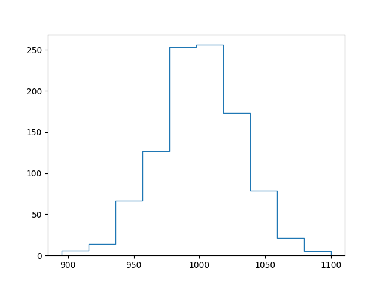
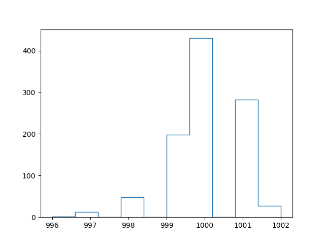
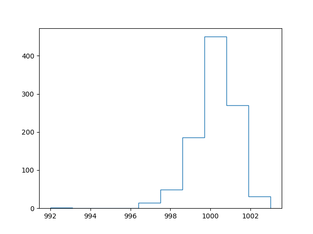

# Power of two random choices

## Comparison

### Standard deviation

| Single random choice | Power of two random choices V1 | Power of two random choices V2 |
| --- | --- | --- |
| 67.04028 | 2.21359 | 1.89736 |

### Single random choice

### Power of two random choices

#### v1

#### v2 (_making sure that there are always 2 different bins to choose from_)

